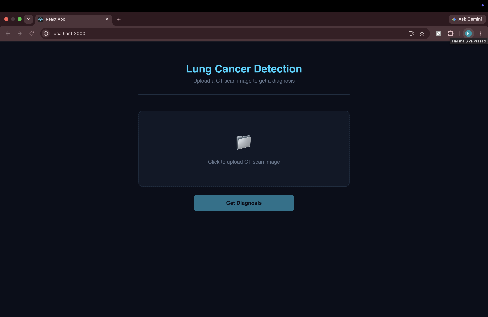
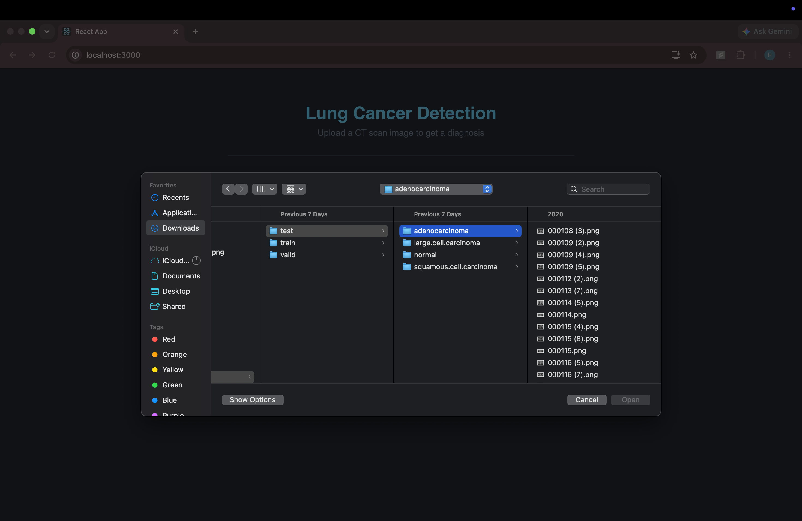
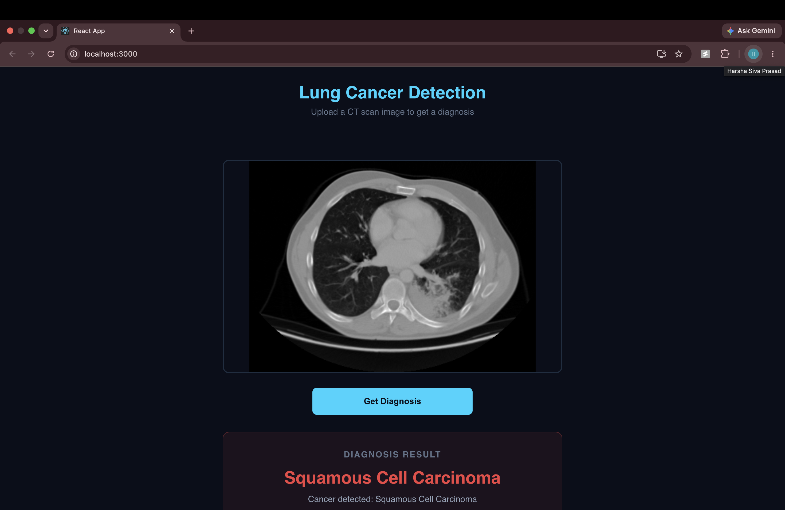

# Lung Cancer Detection Web App

Full stack web application for lung cancer detection from CT scan images.
Built with React frontend, Node.js backend, and VGG19+SVM ML model achieving 81.27% accuracy.

## Demo

### Home Screen

### Upload CT Scan

### Diagnosis Result

## How It Works

1. User uploads a CT scan image
2. Node.js backend receives the image
3. Python script runs VGG19 feature extraction
4. SVM classifier predicts cancer type
5. Diagnosis displayed in real time

## Tech Stack

- Frontend: React.js
- Backend: Node.js, Express
- ML Model: VGG19 + SVM (81.27% accuracy)
- Python: TensorFlow, Scikit-learn, Pickle

## Cancer Types Detected

- Adenocarcinoma
- Large Cell Carcinoma
- Normal (no cancer)
- Squamous Cell Carcinoma

## Setup

### Prerequisites
- Node.js
- Anaconda with tf_env (Python 3.10 + TensorFlow)

### Backend
cd backend
npm install
conda activate tf_env
node server.js

### Frontend
cd frontend
npm install
npm start

## Author

Harsha Siva Prasad Puvvada
MS Computer Science — Texas Tech University
github.com/Harsha123v
